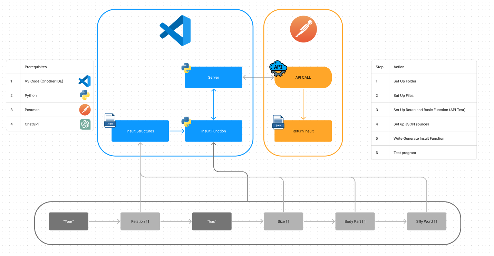

# Insult Generator

Generate hilarious and unique insults with this Python-powered Insult Generator. Whether you need a quick chuckle or are looking to tease a friend, this generator is perfect for the job.
This is the resulting project from a YouTube tutorial from the "Will It AI" channel. You can find the video here: https://youtu.be/CFOsLj2dhBw

## Features

- Randomly selects words from predefined lists to form unique insults.
- Simple and easy-to-use Flask web interface.
- Expandable word lists for endless fun.

## How to Use

1. **Setup**:
   - Ensure you have Flask installed. If not, install it using:
     ```
     pip install Flask
     ```

2. **Run the Program**:
   - Execute the `main.py` file:
     ```
     python main.py
     ```

3. **Visit the Webpage**:
   - Open your web browser and navigate to:
     ```
     http://127.0.0.1:5000/generate-insult
     ```
   - Be sure to change the URL and port as appropriate. Enjoy the randomly generated insults!

## Customizing the Word Lists

Feel free to expand or modify the word lists provided in the `static/data` folder. Just make sure to maintain the JSON structure for smooth operation.

## Try building this project for yourself!


